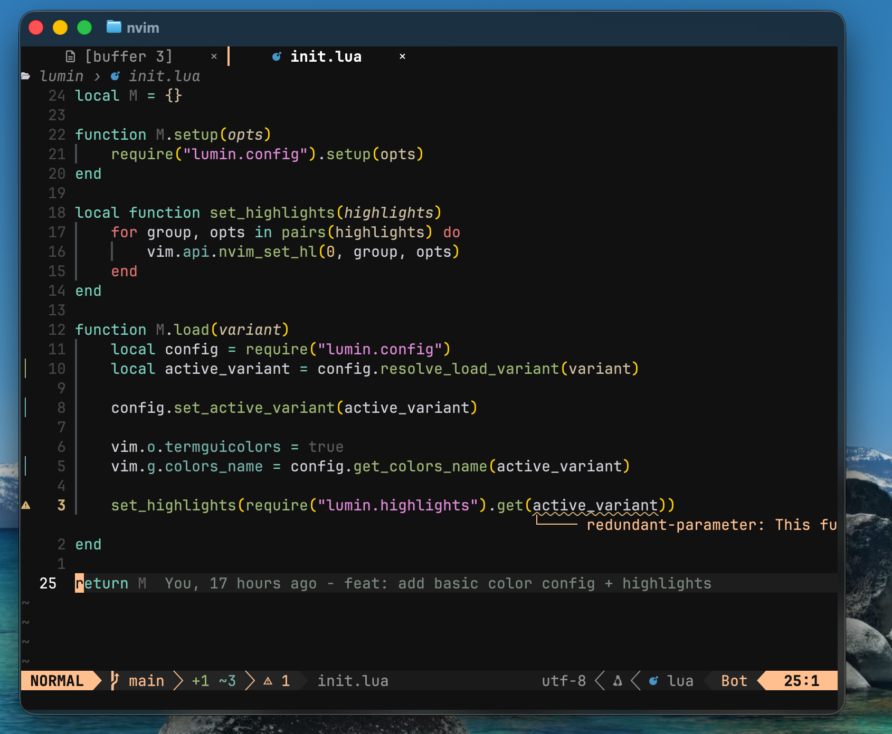
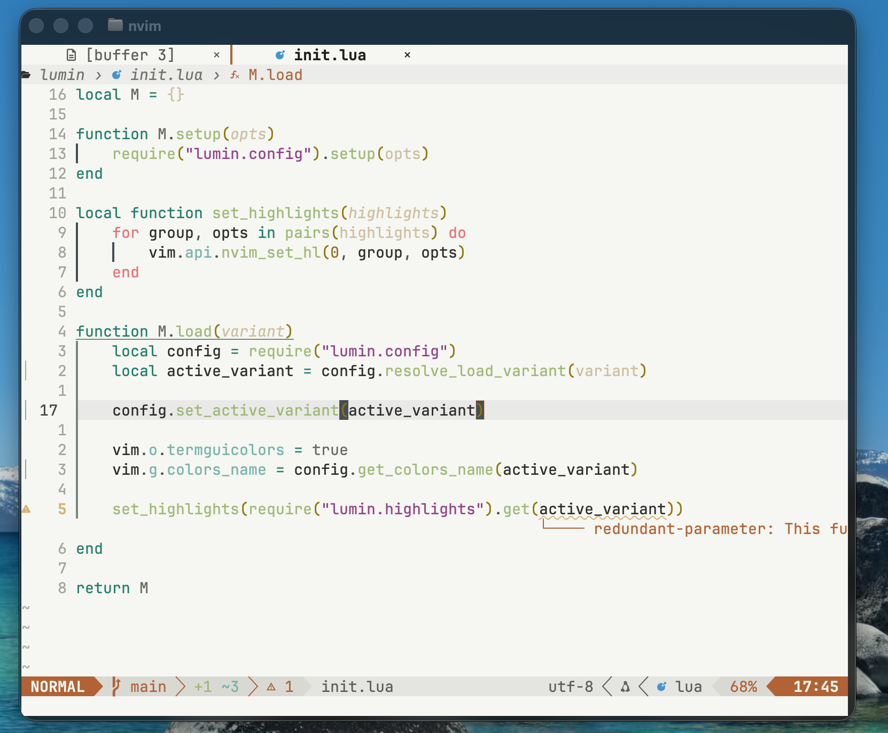
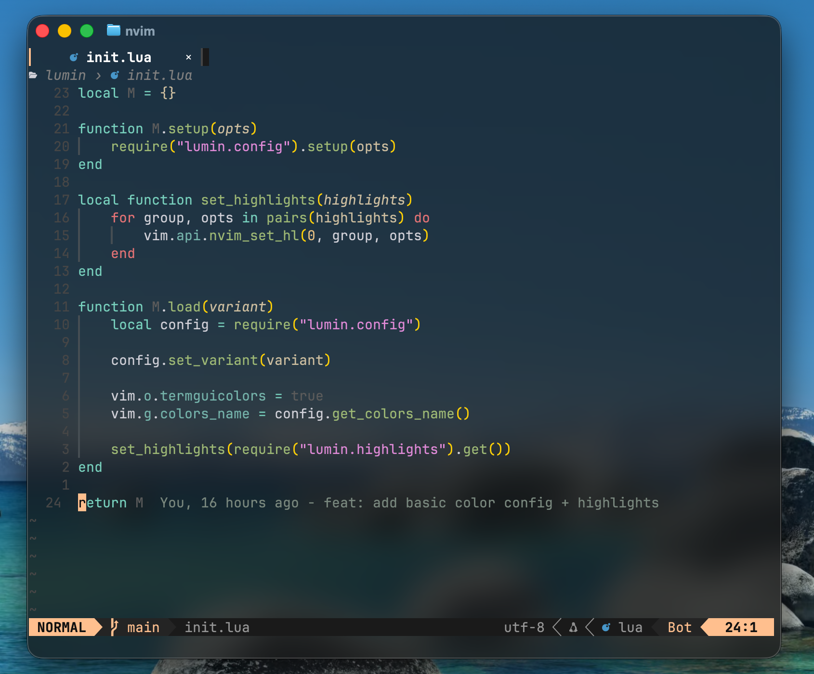

# lumin.nvim

A Neovim colorscheme ported from [frypan05/Lumin](https://github.com/frypan05/Lumin).

---
## Variants

Lumin ships with three variants:

| Variant | Colorscheme |
| --- | --- |
| Regular | `lumin` |
| Light | `lumin-light` |
| Blur | `lumin-blur` |

<details>
<summary>Regular</summary>



</details>

<details>
<summary>Light</summary>



</details>

<details>
<summary>Blur</summary>



</details>

---
## Installation

### Neovim 0.12+ `vim.pack`

```lua
vim.pack.add({
  { src = "https://github.com/fudoge/lumin.nvim", name = "lumin" },
})

vim.cmd.colorscheme("lumin")
```

### Native packages

Using Neovim's package directory directly:

```sh
git clone https://github.com/fudoge/lumin.nvim.git \
  ~/.local/share/nvim/site/pack/colors/start/lumin.nvim
```

Then load the colorscheme:

```lua
vim.cmd.colorscheme("lumin")
```

### Lazy.nvim

Using [lazy.nvim](https://github.com/folke/lazy.nvim):

```lua
{
  "fudoge/lumin.nvim",
  lazy = false,
  priority = 1000,
  config = function()
    vim.cmd.colorscheme("lumin")
  end,
}
```

For the light or blur variants:

```lua
vim.cmd.colorscheme("lumin-light")
vim.cmd.colorscheme("lumin-blur")
```

## Configuration

`setup()` only stores options. `colorscheme` applies the theme.

Use `variant` when you want `colorscheme lumin` to load a specific palette:

```lua
require("lumin").setup({
  variant = "regular", -- "regular", "light", or "blur"
})

vim.cmd.colorscheme("lumin")
```

Or use the dedicated colorscheme files, which set the variant for you:

```lua
vim.cmd.colorscheme("lumin-light") -- uses variant = "light"
vim.cmd.colorscheme("lumin-blur")  -- uses variant = "blur"
```

Blur can be configured with the background color Neovim should expose and the terminal color Lumin should blend transparent UI colors against:

```lua
require("lumin").setup({
  variant = "blur",
  blur_bg = "NONE",
  blur_blend_bg = "#101010",
})

vim.cmd.colorscheme("lumin")
```

For a stronger blur experience, pair `lumin-blur` with a terminal theme that keeps
the same Lumin palette while letting the terminal compositor handle opacity and
blur. For Ghostty:

```ini
background = #101010
foreground = #D6D6DD

cursor-color = #FFC799
cursor-text = #101010

selection-background = #343434
selection-foreground = #FFFFFF

palette = 0=#101010
palette = 1=#FF8080
palette = 2=#99FFE4
palette = 3=#FFC799
palette = 4=#87C3FF
palette = 5=#E394DC
palette = 6=#81D2CE
palette = 7=#D6D6DD
palette = 8=#505050
palette = 9=#FF9A9A
palette = 10=#B7FFEE
palette = 11=#FFD7AD
palette = 12=#A8D4FF
palette = 13=#F0A8E8
palette = 14=#A4EAE1
palette = 15=#FFFFFF
```

```ini
theme = lumin
background-opacity = 0.72
background-blur = 50
```

## Lualine

Lumin provides lualine themes:

```lua
require("lualine").setup({
  options = {
    theme = "lumin",
  },
})
```

Available lualine themes:

| Theme | Behavior |
| --- | --- |
| `lumin` | Uses the current Lumin variant |
| `lumin-light` | Forces the light palette |
| `lumin-blur` | Forces the blur palette |

If lualine displays the mode twice, disable Neovim's built-in mode text:

```lua
vim.o.showmode = false
```

### Lualine overrides

You can override the generated lualine theme directly:

```lua
require("lualine").setup({
  options = {
    theme = require("lumin.integrations.lualine")("light", {
      normal = {
        c = { bg = "NONE" },
      },
    }),
  },
})
```

Or define global and variant-specific overrides through Lumin:

```lua
require("lumin").setup({
  variant = "light",
  integrations = {
    lualine = {
      all = {
        normal = {
          c = { bg = "NONE" },
        },
      },
      light = {
        normal = {
          a = { bg = "#B96F3D" },
        },
      },
    },
  },
})
```

### Bufferline

```lua
require("bufferline").setup({
  highlights = require("lumin.integrations.bufferline")(),
})
```

You can also select a variant and pass direct overrides:

```lua
require("bufferline").setup({
  highlights = require("lumin.integrations.bufferline")("light", {
    fill = {
      bg = "NONE",
    },
  }),
})
```

Or define global and variant-specific overrides through Lumin:

```lua
require("lumin").setup({
  variant = "light",
  integrations = {
    bufferline = {
      all = {
        fill = {
          bg = "NONE",
        },
      },
      light = {
        buffer_selected = {
          italic = true,
        },
      },
    },
  },
})
```

### barbar.nvim

barbar.nvim may set its own highlights after the colorscheme loads. Apply Lumin after
`barbar.setup()` when using barbar:

```lua
require("barbar").setup()
require("lumin.integrations.barbar").apply()
```

You can also define global and variant-specific overrides through Lumin:

```lua
require("lumin").setup({
  integrations = {
    barbar = {
      all = {
        BufferCurrent = {
          italic = true,
        },
      },
    },
  },
})
```

## Supported highlights

Lumin includes highlight groups for:

- Neovim UI and syntax groups
- Treesitter captures
- Diagnostics and diff groups
- Bufferline
- barbar.nvim
- NvimTree
- Neo-tree
- Navic breadcrumbs
- lualine

## Credits

- Original theme: [frypan05/Lumin](https://github.com/frypan05/Lumin)
- Neovim port: [fudoge/lumin.nvim](https://github.com/fudoge/lumin.nvim)

## License

MIT
